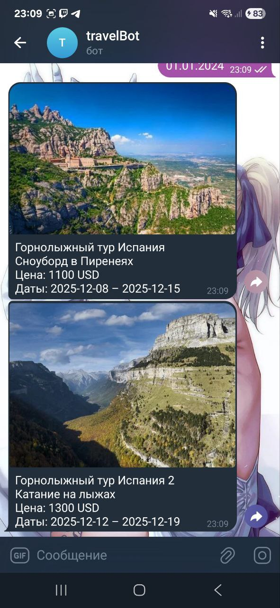

# TravelExpert Bot

Телеграм‑бот для поиска туров, отелей и информации о визах. Пошаговые команды реализованы через конечный автомат (FSM), состояние каждого пользователя хранится отдельно, что позволяет одновременно работать нескольким пользователям.

---

## Возможности

- `/find_tour` — **пошаговая команда (FSM)**: бот спрашивает бюджет → тип отдыха → страну → дату начала → показывает подходящие туры с фотографиями.  
- `/hotels` — **пошаговая команда (FSM)**: бот спрашивает страну → выводит список отелей с ценой, рейтингом и отзывами.  
- `/visa_info` — **пошаговая команда (FSM)**: бот спрашивает страну → выводит визовые требования, документы и контакты.  


> FSM реализован через объект `userStates`, в котором хранится шаг команды для каждого `chatId`.  

---

## Технологии

- **Node.js** (ES‑modules)  
- **node-telegram-bot-api** — интеграция с Telegram  
- **dotenv** — чтение токена из `.env`  
- **SQLite** — локальная база данных туров, отелей и визовой информации (`travel.db`)  
- **Jest** — модульные тесты с coverage  
- **ESLint** — проверка качества кода  

---

## Структура проекта
project/
├─ index.js # точка входа (запуск бота)
├─ server.js # логика бота
├─ src/
│ ├─ commands/
│ │ ├─ findTour.js
│ │ ├─ hotels.js
│ │ └─ visaInfo.js
│ ├─ utils/
│ │ └─ db.js # инициализация и работа с SQLite
│ └─ state/
│ └─ userStates.js # хранение состояния FSM по пользователям
├─ tests/
│ └─ utils.test.js
├─ .env.example # пример переменных окружения
├─ .gitignore
├─ eslint.config.js
├─ jest.config.json
├─ package.json
├─ README.md
├─ images/                # скриншоты работы бота

## Подготовка и запуск

1. Установить зависимости
```bash
npm install

2. Создать .env в корне (можно скопировать из .env.example):

TELEGRAM_BOT_TOKEN=ваш_токен_бота

3.Запустить бота:

npm start

Скрипты
{
  "start": "node ./index.js",
  "dev": "nodemon ./index.js",
  "test": "cross-env NODE_OPTIONS=--experimental-vm-modules jest --passWithNoTests",
  "test:coverage": "cross-env NODE_OPTIONS=--experimental-vm-modules jest --coverage",
  "lint": "eslint .",
  "lint:fix": "eslint . --fix"
}

Тестирование и покрытие

Запуск тестов:

npm test


Отчёт покрытия:

npm run test:coverage

Все тесты должны проходить, coverage threshold настроен согласно требованиям.

Конечный автомат (FSM) для пошаговых команд

Состояния: уникальные шаги каждой команды (askBudget, askType, askCountry, askStartDate, askCountryHotels, askCountryVisa и т.д.)

Переходы: каждый ввод пользователя обновляет step → выполняется логика → переход к следующему шагу

Отмена: /cancel — сброс состояния текущей команды

Изоляция: состояния привязаны к chatId, пользователи не мешают друг другу

База данных: SQLite хранит тестовые туры, отели и визовую информацию, инициализируется автоматически при старте

## Примеры работы





