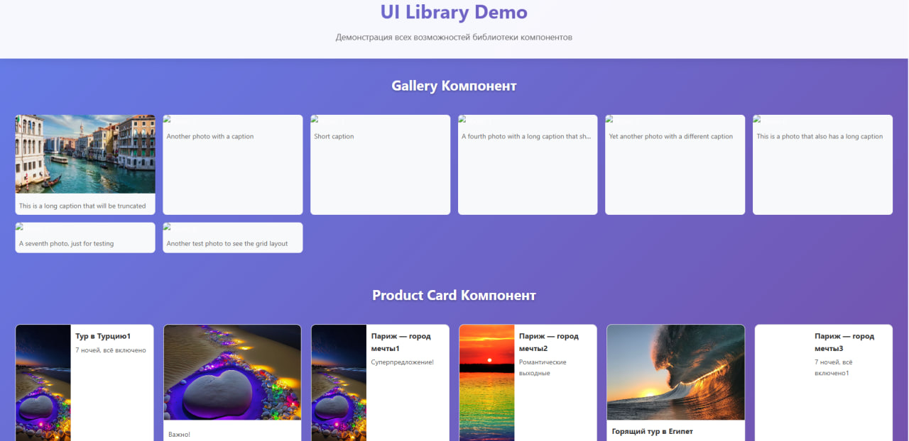

# Lab 5

## Описание проекта

Данный проект является выполнением лабораторной работы №5 по предмету JavaScript. Лабораторная работа состоит из двух отдельных проектов:

- **ui-library** — библиотека UI-компонентов
- **frontend** — демонстрационное приложение, которое показывает работу компонентов

Компоненты реализованы с использованием **React** и **TypeScript**. В проекте используются только собственные компоненты, без сторонних UI-библиотек.

## UI-Library

Библиотека UI-компонентов содержит два компонента, которые реализуют основные функциональные требования задания:

### 1. **Gallery**
Компонент отображает галерею фотографий с подписями в виде плитки.

**Функциональные требования выполнены:**
- Отображение фотографий в виде плитки.
- Очень длинные подписи корректно отображаются:
  - При необходимости обрезаются, и отображается подсказка (hint) при наведении.
- При изменении ширины экрана корректно отображается количество фотографий в ряд (без горизонтального скролла).
- Компонент принимает список объектов для отображения через props.

### 2. **ProductCard**
Компонент для отображения карточки товара.

**Функциональные требования выполнены:**
- Карточка принимает параметры, которые настраивают отображение карточки (фото слева или снизу).
- Карточка корректно отображается и масштабируется, даже если не все параметры переданы.

## Frontend

Приложение демонстрирует примеры использования компонентов из библиотеки **ui-library**.

**Функциональность:**
- Отображение галереи фотографий с подписями.
- Отображение карточек товаров с настройками для расположения фото.
- Использование собственной UI-библиотеки без сторонних зависимостей.

## Инструкция по запуску

**UI-Library:**
```bash
cd ui-library
npm install
npm run build
npm run test
npm run test:coverage
npm run lint
```

**Frontend:**
```bash
cd ../frontend
npm install
npm run build
npm run test
npm run test:coverage
npm run lint
npm run dev
```

**Открой в браузере:** http://localhost:5173

## Скриншоты

**Главный экран frontend:**
